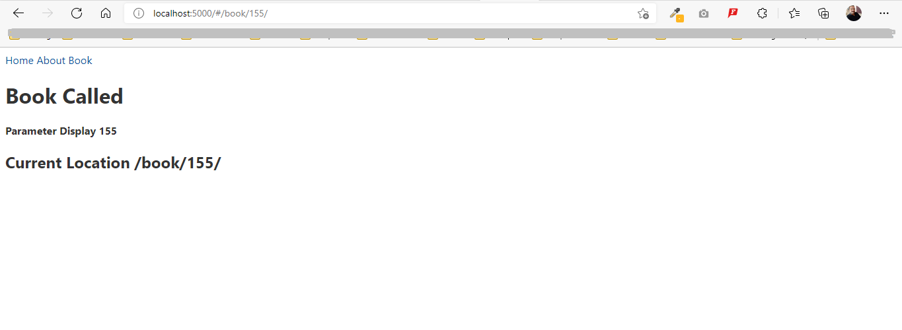

# Svelte Route Demo
 Svelte Route Demo

# You need to install Svelte SPA Router Command is following:

```
npm install svelte-spa-router
```

## Create 3 Files Home.svelte, About.svelte, and book.svelte


#### Home.svelte file code

```
<h1>Home Page Called</h1>  
```
#### About.svelte file code
```
<h1>About Us Called</h1>  
```

#### Book.svelte file code
```
<script>
    export let params = {}; // get parameter
</script>
<h1>Book Called</h1>  
<h4>Parameter Display { params.id }</h4>
```
#### App.svelte file code

```
<script>
	import  Router from 'svelte-spa-router';
	import {location,link} from 'svelte-spa-router';
	import About from './view/about.svelte';
	import Book from './view/book.svelte';
	import Home from './view/Home.svelte';

	let routes = {
		"/": Home,
		"/about": About,
		"/book/:id": Book
	}
</script>

<nav>
	<a use:link href="/">Home</a> // its default add /# between domain and links.
	<a use:link href="/about">About</a>
	<a use:link href="/book/155/">Book</a>
</nav>
<main>
<Router routes={routes} />
<h2>Current Location {$location}</h2>
</main>
```




## How to run Project

- First, Clone the repo.
- install required file for following:
    - npm install
- install svelte-spa-router
    - npm install svelte-spa-router
- run command
    - npm run dev
- Goto Browser and type http://localhost:5000